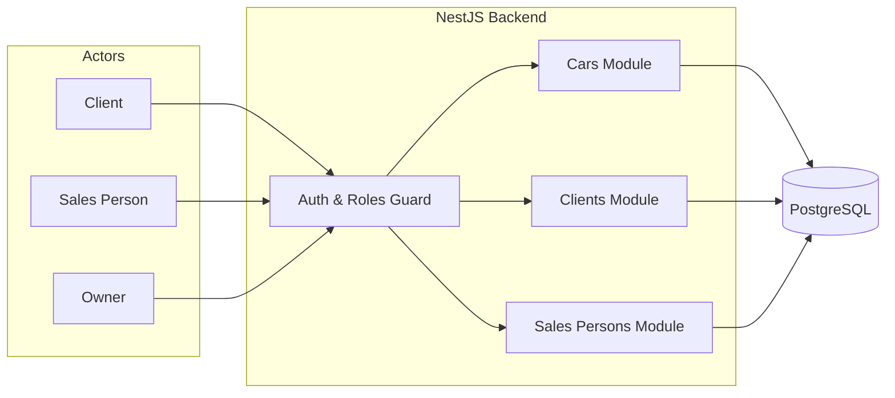
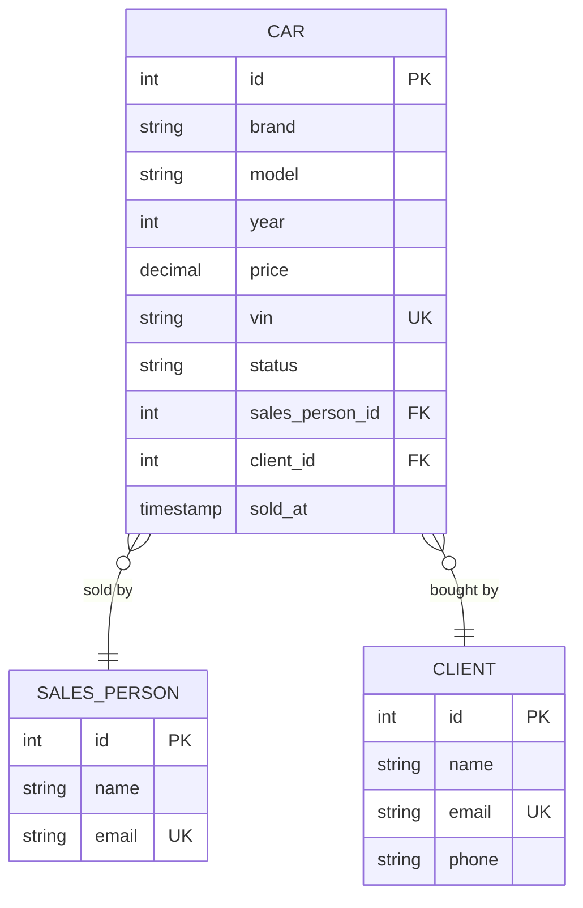
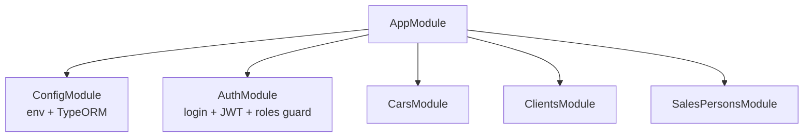

# Car Sales System — Architecture

## Main Idea

A single backend app (NestJS + PostgreSQL) that manages a car dealership.

Four actors interact with the system:

- **Client** — browses cars and buys one (each purchase is tied to a sales person).
- **Sales Person** — sees the shared inventory, sells any available car, and manages their clients.
- **Owner** — sees everything: all cars, all clients, all sales people, and every transaction.

The system is built around **three core entities** (car, client, sales person). A sale isn't a separate entity — it's a state of the car (`sold_at` + `client_id`), because one car is only ever sold once.

## System Overview



- All requests pass through **auth + role guard** first.
- The **owner role** has no restrictions — sees everything.
- **Clients** only see a public car catalog and their own purchases.
- **Sales persons** see the full inventory (all available cars) and can sell any of them; they manage their own clients.

## Database Schema



### Entities & Relationships

| Entity | Purpose | Notes |
|---|---|---|
| **Car** | A car on the lot | `status`: `available` / `sold`. The whole lot is shared inventory for all sales persons. When sold, stores `client_id` + `sold_at` + the `sales_person_id` who closed the deal |
| **Client** | A person who buys cars | Can buy multiple cars over time |
| **Sales Person** | An employee who sells cars | Sees the shared inventory and can sell any available car |

### Key Rules

- **Inventory is shared** — every sales person sees the same full catalog of available cars and can sell any of them.
- `sales_person_id` on a car is set when the car is **sold** — it records *who* closed the deal, not who "owns" the car.
- A **sale is not a separate entity** — it's captured on the car via `client_id` + `sold_at`. This works because one car is sold **exactly once**.
- **Owner** sees all rows; **sales person** sees the shared inventory + their own clients; **client** sees the public catalog + own purchases.
- If a sale history or audit trail is ever needed, a `Sale` table can be introduced later without changing the domain logic.

## Application Structure



Each feature module follows the standard NestJS pattern:

```
src/
├── main.ts
├── app.module.ts
├── config/
│   ├── config.types.ts
│   └── typeorm.config.ts
├── auth/               # login, JWT, role guard
│   ├── auth.module.ts
│   ├── auth.controller.ts
│   ├── auth.service.ts
│   └── roles.guard.ts
├── cars/               # CRUD + catalog (public list) + sell action
├── clients/
└── sales-persons/

    └── entities/       # TypeORM entities per module
```

## Tech Stack

| Layer | Choice |
|---|---|
| Backend | NestJS (TypeScript) |
| Database | PostgreSQL 16 (via docker-compose) |
| ORM | TypeORM |
| Auth | JWT + role-based guard (client / sales-person / owner) |

## Roles Summary

| Role | Can do |
|---|---|
| **Owner** | Everything — all modules, no filters |
| **Sales Person** | View/sell all cars in the inventory, manage their own clients |
| **Client** | Browse car catalog, view own purchases |
